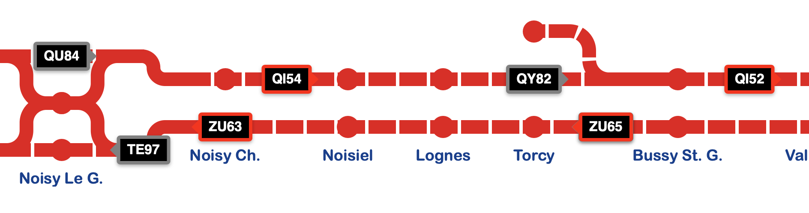
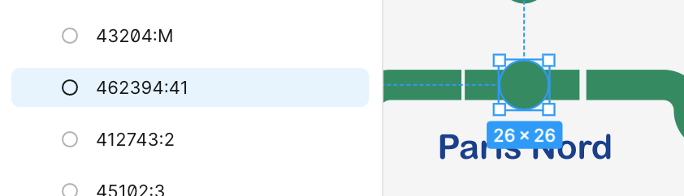
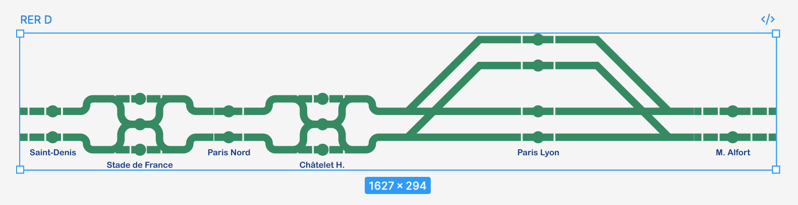
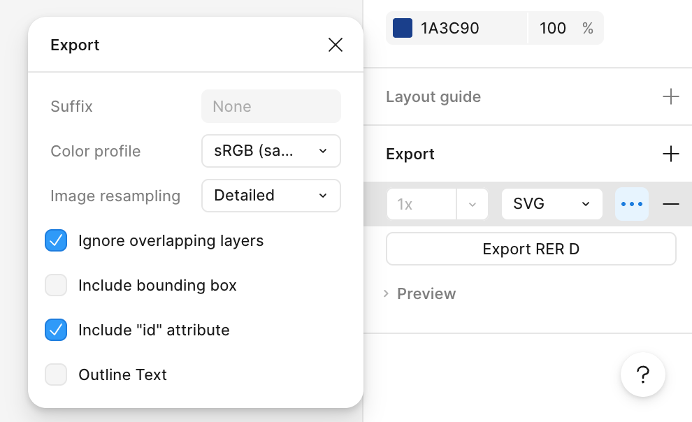

# livetrafic



To start, create a `.env` file at project root with the following content:

```
VITE_PRIM_API_KEY=xxxxxxxxxxxxxx
```

Get your token here https://prim.iledefrance-mobilites.fr/fr/mes-jetons-authentification

Then, run `npm i`, `npm run dev` and go to http://localhost:5173

## Goal

The goal of this project is not to replicate a 1:1 version of official transport companies apps, but highlight the data offered by PRIM global API, to help debugging and see the quality of the data.

## Contribute

### Add or update the map 

Map is just a SVG file embedded in a Vue component. To edit SVG, import it on Figma (or other drawing tool).

You can use demo file in `resources/livetrafic.fig` to start. 

You can draw anthing you want. The only requirement is to have a `rect` element with an id like this : `<stopId>:<platformName>`.



_It's not mandatory to have all stops and platforms, but some trains will not be displayed._

You can find `stopId` here https://prim.iledefrance-mobilites.fr/fr/jeux-de-donnees/arrets-lignes

Before exporting, verify that all stops are encapsulated in the frame and there is no margin. 



When you export SVG, please "Include id attribute" and disable "Outline Text" option.



You can grab the content of the SVG file and paste it in a Vue component. Take exemple on existing ones (`C01728.vue`)

Don't forget to add a `ref="svgRef"` on the `<svg>` tag.

Add required details on `registry.ts` to have your new component displayed on the select.

### Merge request 

You can submit your modifications or additions by creating a merge request.

Please include __only one modification__ per merge request.